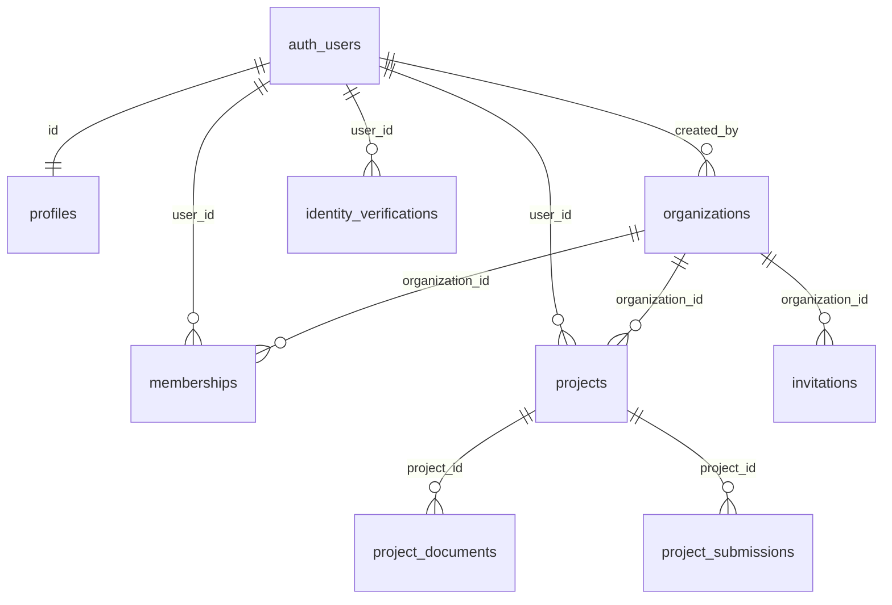
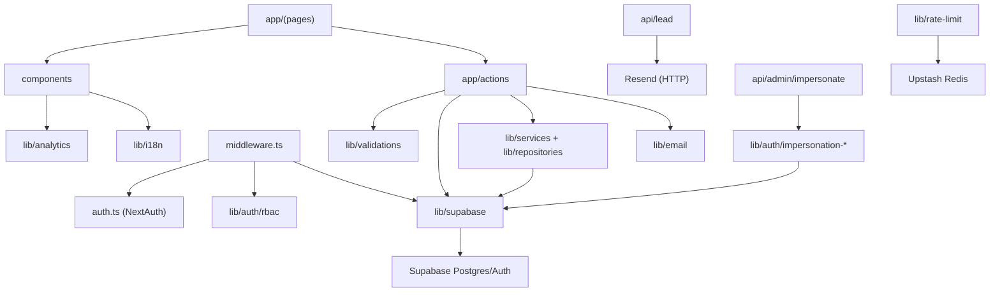

# Bayty — Code Structure Map

> Static, read-only architectural audit. Every claim cites a file path (and line where relevant). Items that cannot be confirmed from source are marked `[UNVERIFIED]`.

## 1. Executive Summary

TL;DR: Bayty is a Next.js 14 App Router marketing site plus a gated, multi-tenant SaaS dashboard for a GCC construction/real-estate platform, backed by Supabase (Postgres + Auth) with a layered RBAC model.

The system is a single Next.js 14.2.15 application (`package.json:49`) combining a public marketing surface (home, product, pricing, solutions, blog, legal pages under `app/`) with an authenticated B2B dashboard for project intake and organization management. Authentication is dual-track: NextAuth v5 beta with a LinkedIn provider (`auth.ts:1-16`) and Supabase email-OTP/magic-link, with `middleware.ts` orchestrating session refresh and access gates. Persistence is Supabase Postgres, defined through three SQL migrations (`supabase/migrations/`) covering KYC, project intake, and a two-level tenancy/RBAC model. The architecture is a **modular monolith**: one deployable Next.js app with clearly separated concern modules under `lib/` (auth, billing, email, supabase, repositories, services, validations). Maturity signals are mixed-to-solid: strict TypeScript (`tsconfig.json:8`), ESLint + Prettier + Husky pre-commit (`.husky/pre-commit`), Vitest unit tests and Playwright E2E (`package.json:15-19`), and hardened HTTP security headers (`next.config.mjs:3-40`). Notable gaps: no CI workflow directory (`.github` absent), zero TODO/FIXME density (clean), and test coverage concentrated on the impersonation subsystem rather than core project/tenancy flows. A founder-only, environment-gated role-impersonation subsystem (`lib/auth/impersonation-*`, `app/api/admin/impersonate/route.ts`) is a significant, well-documented recent addition (`docs/adr/0001-admin-role-impersonation.md`).

## 2. Tech Stack Inventory

TL;DR: TypeScript/Next.js 14 front-to-back, Supabase for data and auth, Resend for email, Upstash Redis for rate limiting.

| Layer | Technology | Version | Source File |
|---|---|---|---|
| Language | TypeScript | ^5.6.3 | `package.json:82` |
| Framework | Next.js (App Router) | 14.2.15 | `package.json:49` |
| UI runtime | React / React DOM | ^18.3.1 | `package.json:51-52` |
| Auth (social) | next-auth (LinkedIn) | ^5.0.0-beta.31 | `package.json:50`, `auth.ts:2` |
| Auth/DB (SSR) | @supabase/ssr | ^0.10.3 | `package.json:41` |
| DB client | @supabase/supabase-js | ^2.107.0 | `package.json:42` |
| Database | Supabase Postgres | `[UNVERIFIED]` (managed; no version in repo) | `supabase/migrations/` |
| Rate limiting | @upstash/ratelimit + @upstash/redis | ^2.0.8 / ^1.38.0 | `package.json:43-44` |
| Email | resend + react-email | ^6.12.4 / ^6.6.0 | `package.json:55,53` |
| Forms/validation | react-hook-form + zod + @hookform/resolvers | ^7.78.0 / ^4.4.3 / ^5.4.0 | `package.json:54,59,31` |
| UI primitives | Radix UI (dialog, select, etc.) | various ^1.x–^2.x | `package.json:32-39` |
| Styling | Tailwind CSS | ^3.4.14 | `package.json:80`, `tailwind.config.ts` |
| Animation | framer-motion | ^11.11.11 | `package.json:47` |
| Icons | lucide-react | ^0.460.0 | `package.json:48` |
| Unit tests | vitest | ^4.1.8 | `package.json:83`, `vitest.config.ts` |
| E2E tests | @playwright/test | ^1.60.0 | `package.json:62`, `playwright.config.ts` |
| Tooling | eslint, prettier, husky, lint-staged, tsx | see devDependencies | `package.json:61-83` |
| Package manager | pnpm (lockfile present) + npm lockfile also present | n/a | `pnpm-lock.yaml`, `package-lock.json` |

Note: both `pnpm-lock.yaml` and `package-lock.json` exist; the `pnpm` config block (`package.json:85-89`) and the larger/more-recent `pnpm-lock.yaml` indicate pnpm is the intended manager. `[UNVERIFIED]` whether `package-lock.json` is stale.

## 3. Repository Topology

TL;DR: Standard Next.js App Router layout, with business logic isolated under `lib/`, server mutations under `app/actions/`, and SQL schema under `supabase/migrations/`.

```
.
├── app/                  # Next.js App Router: pages, layouts, route handlers, server actions
│   ├── actions/          # Server Actions (projects, tenancy, kyc, dev, auth, leads)
│   ├── api/              # Route handlers (auth, lead, admin/impersonate)
│   ├── admin/            # System-admin content editor surface
│   ├── dashboard/        # Gated SaaS app (projects, settings, KYC, org setup)
│   ├── solutions/        # Marketing: per-persona solution pages
│   ├── blog/             # Blog index + [slug] dynamic route
│   └── (marketing pages) # home, product, pricing, about, contact, legal, ar
├── components/           # React components
│   ├── ui/               # Radix-based design-system primitives
│   ├── sections/         # Marketing page sections (hero, pricing-cards, ...)
│   ├── dashboard/        # Dashboard widgets + multi-step project forms
│   ├── forms/            # Shared form components
│   └── dev/              # Impersonation switcher (dev/preview only)
├── lib/                  # Framework-agnostic business logic
│   ├── auth/             # RBAC, tenant resolution, impersonation subsystem
│   ├── supabase/         # Server/client/service Supabase factories
│   ├── repositories/     # Data-access (organizations)
│   ├── services/         # Domain services (tenancy)
│   ├── billing/          # Plan entitlements
│   ├── validations/      # Zod schemas (project steps, kyc)
│   ├── email/            # Transactional email senders
│   ├── db/               # Direct DB helpers (projects, audit)
│   ├── i18n/             # Translation hook
│   └── types/            # Shared TS types (tenancy)
├── supabase/migrations/  # SQL schema: 001 project intake, 002 tenancy, 003 impersonation audit
├── scripts/              # tsx scripts: seed/teardown impersonation users
├── tests/e2e/            # Playwright specs (auth setup, impersonation)
├── messages/             # i18n catalogs (en.json, ar.json)
├── content/              # Static content (posts.ts)
├── emails/               # React-email templates
├── hooks/                # React hooks
├── docs/                 # ADRs + runbooks
├── bayty-brand/          # Brand strategy docs (non-code)
└── investor-outreach/    # Investor docs (non-code)
```

Non-code documentation folders (`bayty-brand/`, `investor-outreach/`, `docs/`) are intentionally excluded from architectural analysis below.

## 4. Entry Points & Runtime Composition

TL;DR: One Next.js server; entry surfaces are the root layout, the edge/runtime middleware, three API route handlers, and a set of server actions invoked from forms.

| Entry point | Type | Reference |
|---|---|---|
| `npm run dev` / `build` / `start` | Next.js lifecycle scripts | `package.json:6-8` |
| Root layout | App shell, metadata, providers | `app/layout.tsx` |
| Middleware | Session refresh + auth/KYC/RBAC gates | `middleware.ts:14`, matcher `middleware.ts:113-125` |
| NextAuth handler | LinkedIn OAuth callback/catch-all | `app/api/auth/[...nextauth]/route.ts` |
| Sign-out handler | Session termination | `app/api/auth/signout/route.ts` |
| Lead intake API | `POST` marketing lead → Resend email | `app/api/lead/route.ts:17` |
| Impersonation API | `POST` dev/preview role impersonation | `app/api/admin/impersonate/route.ts:25` |
| Seed script | Provision impersonation demo users | `scripts/seed-impersonation-users.ts` (`package.json:17`) |
| Teardown script | Remove impersonation demo data | `scripts/teardown-impersonation-users.ts` (`package.json:19`) |
| Server Actions | Form-driven mutations (no HTTP route) | `app/actions/**` (see §5) |

The lead route pins the Node.js runtime (`app/api/lead/route.ts:3`). `[UNVERIFIED]` whether any route runs on the Edge runtime; none declare `export const runtime = 'edge'`.

## 5. Module & Layer Breakdown

TL;DR: Concerns are cleanly separated — `app/actions` for mutations, `lib/auth` for access control, `lib/supabase` for client factories, `lib/validations` for input schemas.

**`app/actions/` — Server Actions (mutation surface)**
- Responsibility: server-side writes invoked directly from React forms.
- Key files: `projects/{create-draft,save-step,submit-project,upload-document,delete-document,get-project,get-projects}.ts`, `tenancy/{create-org,invite-member,accept-invite}.ts`, `kyc/submit-kyc.ts`, `auth.ts`, `submitLead.ts`, `dev/impersonate.ts`.
- Internal deps: `lib/supabase/server`, `lib/validations/*`, `lib/auth/*`.
- External deps: `zod`, `@supabase/ssr`.

**`lib/auth/` — Access control & impersonation**
- Responsibility: org RBAC, tenant resolution, and the four-layer impersonation subsystem.
- Public surface: `checkRouteRbac()` (`rbac.ts:17`), `isImpersonationEnvEnabled()`, `performImpersonation()`, allowlist + audit helpers.
- Key files: `rbac.ts`, `tenant.ts`, `impersonation-{gate,core,session,config,audit,allowlist}.ts` (+ co-located `*.test.ts`).
- Internal deps: `lib/supabase/server`, `lib/types/tenancy`, `lib/site-url`.
- External deps: Node `crypto` (timing-safe compare), `@supabase/supabase-js`.

**`lib/supabase/` — Client factories**
- Responsibility: construct request-scoped (`createClient`), browser (`client.ts`), and service-role (`createServiceClient`) Supabase clients.
- Public surface: `server.ts:8` (`createClient`), `server.ts:36` (`createServiceClient`), `client.ts`, `auth.ts`.
- Note: both factories return `null` when env vars are absent to allow pre-wiring builds (`server.ts:11`).

**`lib/validations/` — Input schemas**
- Responsibility: Zod schemas for the 5-step project intake wizard and KYC.
- Key files: `project/{master-schema,step-1..5-schema,index}.ts`, `kyc/kyc-schema.ts`.

**`lib/repositories/` + `lib/services/` — Data access & domain logic**
- `repositories/organizations.ts` (CRUD), `services/tenancy.ts` (org/membership orchestration).

**`lib/billing/`, `lib/email/`, `lib/db/`, `lib/i18n/`, `lib/analytics.ts`, `lib/rate-limit.ts`**
- `billing/entitlements.ts` (plan gating), `email/send-project-submitted.ts` (Resend), `db/{projects,audit}.ts`, `i18n/use-t.ts`, `analytics.ts` (typed GA4 event catalog, `analytics.ts:30-38`), `rate-limit.ts` (Upstash).

**`components/` — Presentation**
- `ui/` (Radix design system), `sections/` (marketing), `dashboard/steps/` (multi-step forms), `dev/impersonation-switcher.tsx`.

## 6. Data Layer

TL;DR: Supabase Postgres with raw SQL migrations (no ORM); schema spans KYC, a 5-step project-intake pipeline, two-level tenancy, and a locked-down impersonation audit log.

- Connection setup: `lib/supabase/server.ts` (anon, request-scoped + service-role); browser client `lib/supabase/client.ts`.
- Migration tooling: raw `.sql` files in `supabase/migrations/` — `001_project_intake.sql`, `002_tenancy.sql`, `003_impersonation_audit.sql`. `[UNVERIFIED]` whether a migration runner (Supabase CLI) is used; applied manually per `docs/runbooks/impersonation.md`.
- ORM: none — direct `supabase.from(...)` query builder calls.
- Cache: Upstash Redis is present for rate limiting (`lib/rate-limit.ts`); `[UNVERIFIED]` whether it caches any domain data.
- RLS: `impersonation_audit_log` is RLS-enabled with zero permissive policies and revoked from `anon`/`authenticated` (`supabase/migrations/003_impersonation_audit.sql:30-33`).

Tables (from `create table` statements): `profiles`, `organizations`, `memberships`, `invitations`, `identity_verifications`, `projects`, `project_documents`, `project_submissions`, `audit_log`, `impersonation_audit_log`.



(Relationships derived from `references` clauses in `supabase/migrations/001_project_intake.sql` and `002_tenancy.sql`.)

## 7. API Surface

TL;DR: Only three HTTP route handlers exist; most server interaction happens through Next.js Server Actions, which are not HTTP routes.

| Method | Path/Name | Handler File:Line | Auth Required |
|---|---|---|---|
| GET/POST | `/api/auth/[...nextauth]` | `app/api/auth/[...nextauth]/route.ts` | Public (OAuth flow) |
| POST | `/api/auth/signout` | `app/api/auth/signout/route.ts` | Session |
| POST | `/api/lead` | `app/api/lead/route.ts:17` | Public (validated input) |
| POST | `/api/admin/impersonate` | `app/api/admin/impersonate/route.ts:25` | Env gate + secret header + founder allowlist (else 404) |

Server Actions (RPC-style, no public URL) — primary mutation surface:

| Name | File | Auth Required |
|---|---|---|
| `submitLead` | `app/actions/submitLead.ts` | Public |
| project create/save/submit/upload/delete/get | `app/actions/projects/*.ts` | Session + KYC + org (via middleware) |
| create-org / invite-member / accept-invite | `app/actions/tenancy/*.ts` | Session; role-checked |
| submit-kyc | `app/actions/kyc/submit-kyc.ts` | Session |
| impersonateRole | `app/actions/dev/impersonate.ts` | Env gate + founder allowlist |

`[UNVERIFIED]` per-action authorization details beyond middleware gating; would be resolved by reading each action body.

## 8. Cross-Cutting Concerns

TL;DR: Auth/KYC/RBAC are centralized in middleware + `lib/auth`; config is env-driven; analytics is consent-gated GA4; security headers are set globally.

- **Auth**: dual — NextAuth LinkedIn (`auth.ts`) and Supabase email-OTP. Middleware refreshes Supabase sessions and gates `/admin`, `/account`, `/dashboard` (`middleware.ts:22-100`).
- **Authorization (RBAC)**: 5-tier org roles ranked owner>admin>manager>member>viewer (`lib/auth/rbac.ts:5-15`); route→min-role map enforced in middleware (`middleware.ts:91-95`).
- **KYC gate**: `/dashboard` requires an `approved` `identity_verifications` row (`middleware.ts:71-82`).
- **Config/env**: read directly via `process.env`; documented in `.env.example`. Keys include Supabase URL/anon/service-role, Resend, Upstash, NextAuth LinkedIn, GA, and the impersonation flag/secret.
- **Error handling**: route handlers return structured JSON with explicit status codes (`app/api/lead/route.ts:22-77`); impersonation fails closed to 404 (`app/api/admin/impersonate/route.ts:23`).
- **Logging/telemetry**: server `console.warn/error` in route handlers; client-side typed GA4 event catalog (`lib/analytics.ts:30-38`), consent-gated (`analytics.ts:16-22`).
- **i18n**: `messages/en.json` + `messages/ar.json`, hook `lib/i18n/use-t.ts`; Arabic route segment `app/ar/`.
- **Rate limiting**: Upstash (`lib/rate-limit.ts`). `[UNVERIFIED]` which endpoints invoke it.
- **Feature flags**: `NEXT_PUBLIC_ENABLE_ADMIN_IMPERSONATION` env flag gates the impersonation subsystem (`lib/auth/impersonation-gate.ts`).
- **Security headers**: X-Frame-Options DENY, HSTS, Permissions-Policy, CSP-Report-Only, env-aware X-Robots-Tag (`next.config.mjs:3-71`); non-www→www 301 redirect (`next.config.mjs:48-57`).

## 9. Build, Test & Deployment Pipeline

TL;DR: Standard Next.js build with Husky-enforced lint-staged commits, Vitest + Playwright tests, and Vercel as the implied deploy target — but no CI workflow is committed.

- **Build/scripts**: `dev`, `build`, `start`, `lint`, `typecheck`, `test`, `test:e2e`, plus impersonation `seed`/`teardown` (`package.json:6-19`).
- **Pre-commit**: Husky runs `lint-staged` → ESLint + Prettier (`.husky/pre-commit`, `package.json:21-28`).
- **Unit tests**: Vitest, node environment, excludes node_modules/.next/.claude/e2e (`vitest.config.ts`). Existing tests are auth/impersonation-focused (`lib/auth/*.test.ts`).
- **E2E**: Playwright, founder-auth setup project + chromium project (`playwright.config.ts`, `tests/e2e/`).
- **CI**: none committed — `.github/` is absent. `[UNVERIFIED]` whether CI runs externally.
- **Containerization/IaC**: none — no Dockerfile, no Terraform.
- **Deploy target**: Vercel inferred from `VERCEL_ENV` usage (`next.config.mjs:69`) and `CNAME`. `[UNVERIFIED]` (no committed Vercel config file).

## 10. Dependency Graph (Textual)

TL;DR: Pages and actions depend inward on `lib/`; `lib/auth` and the impersonation subsystem both depend on `lib/supabase`; nothing in `lib` depends back on `app`.



## 11. Risk & Smell Register

TL;DR: No CI and thin test coverage of core flows are the main risks; a few large client components and a duplicate lockfile are lower-severity cleanups.

| Finding | Location | Severity | Suggested Action |
|---|---|---|---|
| No CI pipeline committed | `.github/` absent | High | Add a GitHub Actions workflow running `typecheck`, `lint`, `test`, and `build` on PRs. |
| Test coverage concentrated on impersonation; core project/tenancy actions untested | `lib/auth/*.test.ts` only; `app/actions/projects`, `app/actions/tenancy` have no tests | High | Add Vitest coverage for `create-draft`, `submit-project`, and tenancy invite/accept flows. |
| Duplicate lockfiles (`pnpm-lock.yaml` + `package-lock.json`) | repo root | Med | Delete `package-lock.json`, commit to pnpm only, add a `packageManager` field. |
| God file: 679-LOC client component | `app/demo/demo-client.tsx` | Med | Extract sub-sections into `components/sections` to keep the file under ~300 LOC. |
| God file: 658-LOC client component | `app/product/product-client.tsx` | Med | Same extraction strategy as above. |
| CSP is Report-Only (not enforced) | `next.config.mjs:27` | Med | After a clean reporting period, promote to enforcing `Content-Security-Policy`. |
| `isSystemAdmin` hardcoded `false` in middleware RBAC | `middleware.ts:93` | Med | Wire to `profiles.role` so system admins bypass org-role gates as intended. |
| Service-role client returns null silently when env missing | `lib/supabase/server.ts:39` | Low | Log a warning when service ops are attempted without the key to ease debugging. |
| No TODO/FIXME markers but several `[UNVERIFIED]` runtime assumptions | see §13 | Low | Document deploy/CI/runtime in a CONTRIBUTING or `docs/ARCHITECTURE.md` (exists — extend it). |

## 12. Onboarding Checklist

TL;DR: Read the gate logic and client factories first, then the data schema, then one full feature slice (project intake).

1. `middleware.ts` — the single chokepoint for auth, KYC, org, and RBAC gating; explains how every protected route behaves.
2. `lib/auth/rbac.ts` — the 5-tier role model and route→role mapping referenced throughout the dashboard.
3. `lib/supabase/server.ts` — how request-scoped vs service-role DB clients are created (and the null-safe pre-wiring pattern).
4. `auth.ts` — the NextAuth/LinkedIn half of the dual auth system.
5. `supabase/migrations/002_tenancy.sql` and `001_project_intake.sql` — the data model (orgs, memberships, projects, KYC).
6. `app/actions/projects/create-draft.ts` → `save-step.ts` → `submit-project.ts` — a complete feature slice from draft to submission.
7. `lib/validations/project/master-schema.ts` — the Zod contract for the 5-step intake wizard.
8. `docs/adr/0001-admin-role-impersonation.md` + `app/api/admin/impersonate/route.ts` — the security model for the founder impersonation subsystem.
9. `next.config.mjs` — security headers, redirects, and environment-aware behavior.
10. `.env.example` — the full set of required runtime configuration.

## 13. Open Questions

TL;DR: Most unknowns concern runtime/deploy infrastructure not represented in the repository.

- `[UNVERIFIED]` Deployment target — Vercel is inferred from `VERCEL_ENV` (`next.config.mjs:69`) and `CNAME`, but no committed Vercel config confirms it.
- `[UNVERIFIED]` CI — no `.github/` directory; whether tests/lint run automatically is unknown.
- `[UNVERIFIED]` Package manager of record — both `pnpm-lock.yaml` and `package-lock.json` are committed; is `package-lock.json` stale?
- `[UNVERIFIED]` Migration runner — whether `supabase/migrations/*.sql` are applied via Supabase CLI or manually (runbook implies manual).
- `[UNVERIFIED]` Rate-limiting coverage — `lib/rate-limit.ts` exists but the endpoints that invoke it were not confirmed in this pass.
- `[UNVERIFIED]` Edge vs Node runtime per route — only `app/api/lead/route.ts:3` declares a runtime (`nodejs`).
- `[UNVERIFIED]` System-admin enforcement — `middleware.ts:93` hardcodes `isSystemAdmin = false`; whether `profiles.role` is enforced elsewhere is unconfirmed.
